  

  
  
  

---

### 👋 Hi, I'm Manan Jain

Building production-grade AI systems powered by **LLMs, Knowledge Graphs, and Agentic Workflows.** Enthusiast of modern frameworks, sci-fi movies, and the occasional bit of writing.

- 💼 AI Engineer, focused on **Agentic AI**, **RAG**, and **Full Stack Development**
- 🤖 Building multi-agent systems with **LangGraph**, **CrewAI**, and **MCP**
- 📚 Fine-tuning open source LLMs (**Qwen**, **Llama**)
- 🧠 RAG • Knowledge Graphs • Vector Databases
- ☁️ AWS | Azure | GCP
- 🌱 Currently deep in **Agentic AI systems design**

---

### 🏆 Achievements

| | |
|---|---|
| 🥇 | Adobe India Hackathon — **Winner** |
| 🥇 | Government of India AI Hackathon — **Winner** |
| 🥈 | Google Cloud GenAI Hackathon — **Finalist** |
| 🏅 | Claude Impact Lab — **Finalist** |
| 🏆 | Multiple national AI competitions — **Top Teams** |

---

### 🔥 Featured Projects

<table>
<tr>
<td width="50%">

**🤖 Telecom Copilot**
Production AI copilot for telecom engineers
`LoRA-tuned Qwen` `Hybrid RAG` `Knowledge Graph` `MCP Server` `Voice Input` `Mermaid Diagrams`

</td>
<td width="50%">

**📰 TruthTell**
AI-powered fake news detection
`Gemini` `OCR` `Whisper` `RAG` `Explainable AI`

</td>
</tr>
<tr>
<td width="50%">

**📄 Resume Builder**
Generate professional resumes on the fly
`Adobe PDF Services API` `Express` `React`

</td>
<td width="50%">

**🔍 QueryFusion**
Chrome extension to search multiple AI providers at once
`Gemini` `Ollama` `Google` `YouTube`

</td>
</tr>
<tr>
<td width="50%">

**📊 ETMS**
Employee Training Management System
`MERN` `Snowflake` `Machine Learning` `Power BI`

</td>
<td width="50%">

**🧠 Neural-Networks**
Notebooks exploring neural net fundamentals
`Jupyter` `Python`

</td>
</tr>
</table>

---

### 💻 Tech Stack

**Languages**

**AI / ML**

**Backend & Frontend**

**Databases & Cloud**

---

### 📈 GitHub Stats

  

  

> These are generated automatically once a day by a GitHub Action and committed straight into this repo as static SVGs — so they always render, with zero dependency on third-party servers being up. See setup instructions below.

---

### 🌐 Connect

<i>Thanks for stopping by — always open to collabs on AI/agentic projects 🚀</i>

